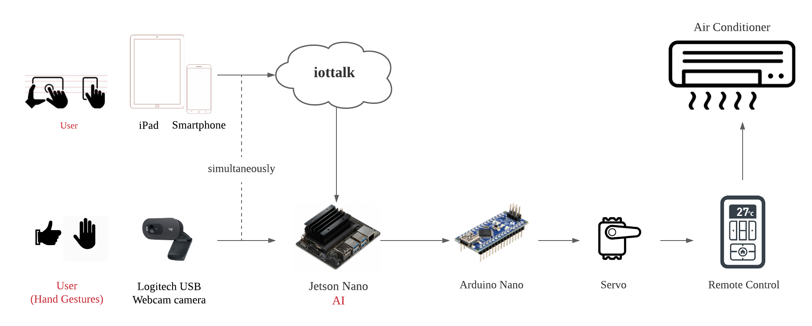

# AIoT

Controlling the Air Conditioner using iPad and Hand Gestures in Real-Time - AIoT - Jetson Nano 
------------------------------------------------------------------------------------------------

## [Demo Video](https://www.youtube.com/watch?v=lcIxm7Vb4Gs)

### System diagram

  

### Contactless - Controlling the AC via a single touch using your Smartphone/iPad from anywhere
* No longer worry about where your AC remote control is.
* You can turn the AC on from anywhere outside if you want the house to get cool before heading back home.
* You can turn the AC off from anywhere outside if you forget this when leaving home.

### Touchless - Controlling the AC with simple hand gestures
* If you don’t want to hand-touch digital devices, AC can be still easily controlled by very simple hand gestures: ‘thumb up’ to turn on and ‘stop sign’ to turn off.
* It is user-friendly and suitable for children or elders.
 
### Flexible to switch between two controlling modes
* You can turn on the AC using your phone, and turn it off using hand gestures, and vice versa.

## Hardware 
* 1x Jetson Nano
* 1x Arduino Nano
* 1x MG90S Servo
* 1x Ipad or 1x Smartphone
* 1x Logitech camera

## IoT Softwares
* IoTtalk 

### Acknowledgements
1. https://iottalk.vip/0/
2. https://github.com/satinder147/DeepWay.v2
3. https://github.com/MIT-HAN-LAB/temporal-shift-module
